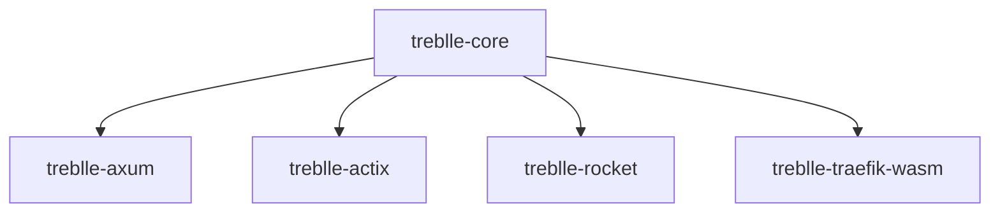

# Treblle SDK for Rust

[](LICENSE)
[](https://github.com/Treblle/treblle-rust/actions/workflows/rust.yml)

Official Rust SDK for [Treblle](https://treblle.com). Treblle makes it super easy to understand what's going on with your APIs and the apps that use them.

## Project Structure



- `treblle-core`: Core functionality and shared components
- `treblle-axum`: Integration for the Axum web framework
- `treblle-actix`: Integration for the Actix-web framework
- `treblle-rocket`: Integration for the Rocket web framework
- `treblle-traefik-wasm`: WASM plugin for Traefik

Each middleware must:
- Intercept HTTP traffic non-intrusively
- Process only `application/json` content on non-ignored routes
- Extract and mask sensitive data before sending to Treblle API
- Send data to Treblle asynchronously (fire-and-forget)
- Never modify original request/response data
- Handle errors gracefully without impacting main flow

## Development Setup

### Prerequisites

- Rust 1.82+ (MSRV)
- Docker (for integration tests)
- Make (optional for DX, but recommended)

### Building

Build all packages

```bash
cargo build
```

Build specific package

```bash
cargo build -p treblle-core
```

### Testing

Run all tests

```bash
make test
```

Run specific test suite

```bash
make test-core
make test-axum
make test-actix
make test-rocket
make test-wasm
```

### Running Integration Tests

Run monitoring & metrics infrastructure first

```bash
cd tests
make monitoring
```

Run specific test suite

```bash
cd tests
make test-core
make test-axum
make test-actix
make test-rocket
make test-wasm
```

## Contributing

1. Fork the repository
2. Create a feature branch (`git checkout -b feature/amazing-feature`)
3. Commit your changes (`git commit -m 'Add amazing feature'`)
4. Push to the branch (`git push origin feature/amazing-feature`)
5. Open a Pull Request

### Code Style

- Run `cargo fmt` before committing
- Run `cargo clippy` to catch common mistakes and improve code quality
- Add tests for new features
- Update documentation when changing public APIs

## Support

- [Documentation](https://docs.treblle.com)
- [GitHub Issues](https://github.com/Treblle/treblle-rust/issues)
