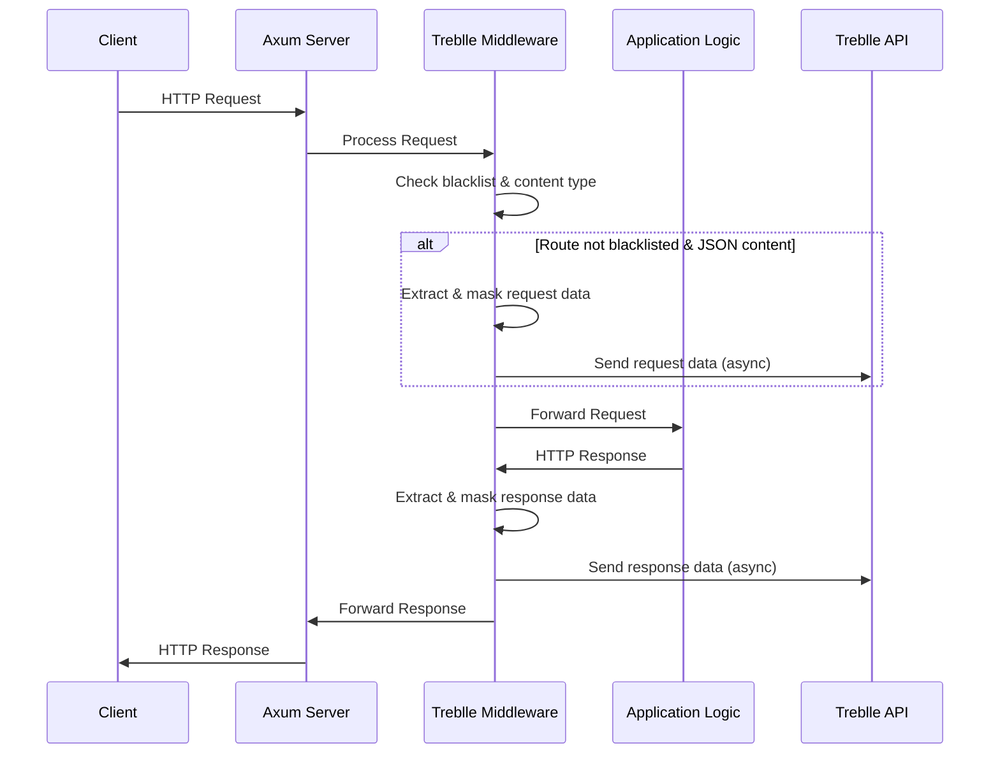

# Treblle Axum

```mermaid
sequenceDiagram
    participant Client
    participant Axum Server
    participant Treblle Middleware
    participant Application Logic
    participant Treblle API

    Client->>Axum Server: HTTP Request
    Axum Server->>Treblle Middleware: Process Request
    Treblle Middleware->>Treblle Middleware: Check blacklist & content type
    alt Route not blacklisted & JSON content
        Treblle Middleware->>Treblle Middleware: Extract & mask request data
        Treblle Middleware->>Treblle API: Send request data (async)
    end
    Treblle Middleware->>Application Logic: Forward Request
    Application Logic->>Treblle Middleware: HTTP Response
    Treblle Middleware->>Treblle Middleware: Extract & mask response data
    Treblle Middleware->>Treblle API: Send response data (async)
    Treblle Middleware->>Axum Server: Forward Response
    Axum Server->>Client: HTTP Response
```