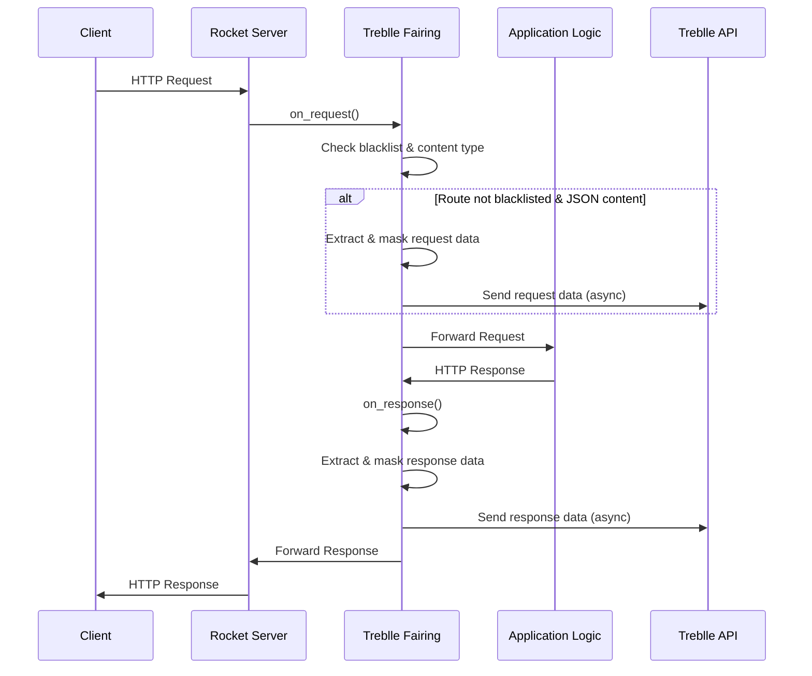

# Treblle Rocket

```mermaid
sequenceDiagram
    participant Client
    participant Rocket Server
    participant Treblle Fairing
    participant Application Logic
    participant Treblle API

    Client->>Rocket Server: HTTP Request
    Rocket Server->>Treblle Fairing: on_request()
    Treblle Fairing->>Treblle Fairing: Check blacklist & content type
    alt Route not blacklisted & JSON content
        Treblle Fairing->>Treblle Fairing: Extract & mask request data
        Treblle Fairing->>Treblle API: Send request data (async)
    end
    Treblle Fairing->>Application Logic: Forward Request
    Application Logic->>Treblle Fairing: HTTP Response
    Treblle Fairing->>Treblle Fairing: on_response()
    Treblle Fairing->>Treblle Fairing: Extract & mask response data
    Treblle Fairing->>Treblle API: Send response data (async)
    Treblle Fairing->>Rocket Server: Forward Response
    Rocket Server->>Client: HTTP Response
```