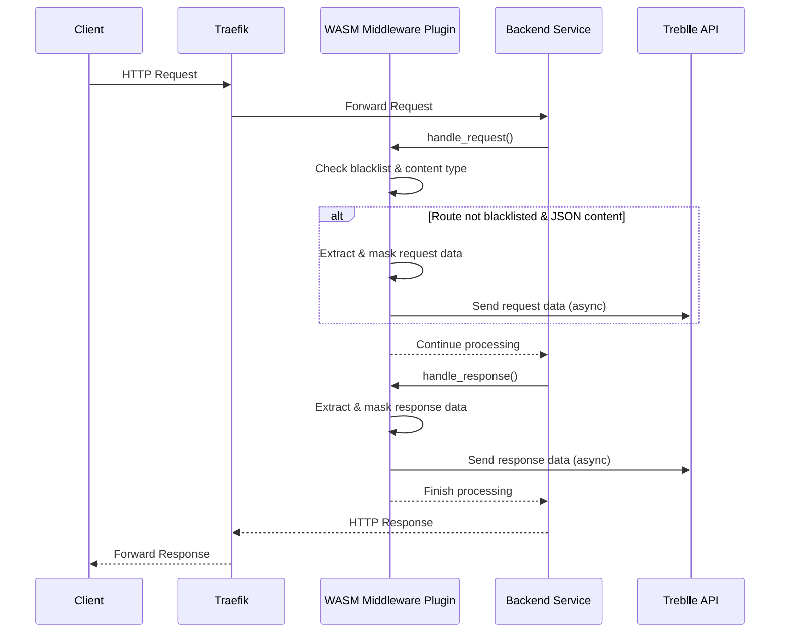

# Treblle Traefik WASM

```mermaid
sequenceDiagram
    participant Client
    participant Traefik
    participant WASM Middleware Plugin
    participant Backend Service
    participant Treblle API

    Client->>Traefik: HTTP Request
    Traefik->>Backend Service: Forward Request
    Backend Service->>WASM Middleware Plugin: handle_request()
    WASM Middleware Plugin->>WASM Middleware Plugin: Check blacklist & content type
    alt Route not blacklisted & JSON content
        WASM Middleware Plugin->>WASM Middleware Plugin: Extract & mask request data
        WASM Middleware Plugin->>Treblle API: Send request data (async)
    end
    WASM Middleware Plugin-->>Backend Service: Continue processing
    Backend Service->>WASM Middleware Plugin: handle_response()
    WASM Middleware Plugin->>WASM Middleware Plugin: Extract & mask response data
    WASM Middleware Plugin->>Treblle API: Send response data (async)
    WASM Middleware Plugin-->>Backend Service: Finish processing
    Backend Service-->>Traefik: HTTP Response
    Traefik-->>Client: Forward Response
```
